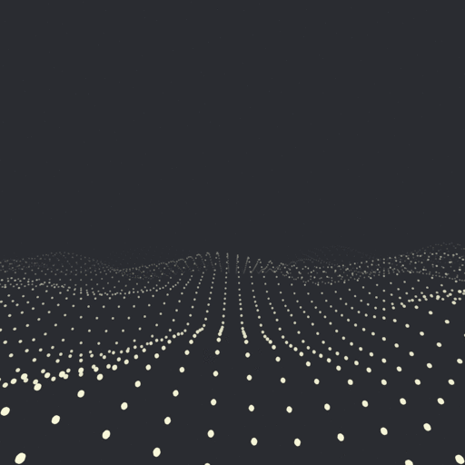

# experiments

This repo contains my personal framework(-ish) to easily get going on different types of browser experiments (canvas, 3d, svg), along with a collection of helper utilities that are commonly used for creative coding.

All the experiments can be run on [https://deniz.co/experiments](https://deniz.co/experiments).

## Usage

### `bin/new [boilerplate]`

Creates a new experiment to `src/[next-experiment-no]` folder. Avaliable boilerplates:
- `blank`: Blank template
- `p5js`: [p5.js](https://p5js.org/) template for processing sketches
- `threejs`: [three.js](https://threejs.org/) template for 3d scenes
- `twojs`: [two.js](https://two.js.org/) template for svg experiments

### `bin/start [experiment-no]`

Starts a development server for specified experiment on `http://localhost:1234`.

### `bin/build [experiment-no]`

Build specified experiment in production mode to `/dist-prod` folder.
